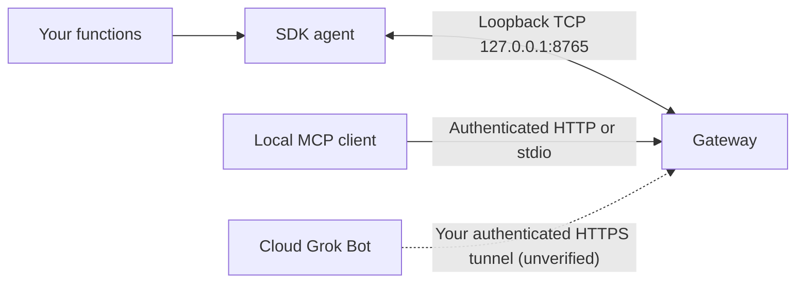

# Grok Gadgets Linux SDK

Turn Python functions into gadgets your Grok Bot can call through the
[Grok Gadgets gateway](https://github.com/adidshaft/grok-gadgets-gateway). Start with a
software lamp; add your hardware code later. Experimental alpha: Grok Bot and hardware are
not verified yet. See the [project status](https://grok-gadgets.pages.dev/doc-docs-public-support-matrix).

## Quickstart

Needs Git and [uv](https://docs.astral.sh/uv/getting-started/installation/). Packages are
not on PyPI yet.

```sh
git clone https://github.com/adidshaft/grok-gadgets-linux-sdk.git
cd grok-gadgets-linux-sdk
uv sync --extra gateway
```

Save this as `my_gadget.py`:

```python
from grok_gadgets_linux import Gadget

lamp = Gadget("desk-lamp", "Desk lamp", state={"on": False})


@lamp.command("Turn the desk lamp on or off")
def set_light(on: bool) -> dict:
    # Your hardware code goes here, for example gpio.write(17, on).
    return {"on": on}
```

Run it:

```sh
uv run grok-linux-agent dev ./my_gadget.py
```

`dev` starts a local gateway, connects your gadget with no token to copy, and prints MCP
client settings. Call `set.light` from any MCP client, for example
[MCP Inspector](https://github.com/adidshaft/grok-gadgets-gateway/blob/main/docs/first-success.md).

## Details

- [Develop a gadget](docs/development.md): the decorator API, plain vs. async functions, GPIO,
  events, state limits, shutdown hooks and the original `Device` API.
- Run beside a long-running `grok-gadgets-gateway serve` instead of `dev`:
  `grok-gadgets-gateway enroll desk-lamp --token-file desk-lamp.token`, then
  `grok-linux-agent --factory-file ./my_gadget.py --token-file desk-lamp.token`.
- [Run and recover](docs/operation.md): MCP client setup, systemd user service,
  reconnect limits and exit codes.
- [Security](SECURITY.md): trust model and known limits.
- [Contributing](CONTRIBUTING.md), [support](SUPPORT.md) and
  [GitHub Issues](https://github.com/adidshaft/grok-gadgets-linux-sdk/issues).

Documentation uses an [ASD-STE100-inspired writing guide](https://github.com/adidshaft/grok-gadgets/blob/main/docs/contributing/writing-guide.md). Formal compliance is not claimed.

### How it fits together



The SDK implements the device; the gateway routes assistant requests. They are separate
packages. The agent connects only to loopback (`127.0.0.1` or `::1`), so run it on the
gateway's computer. The builder runs the gateway; Grok/xAI hosts Grok Bot. A tunnel adds
reachability, not authentication. See the
[hosting FAQ](https://github.com/adidshaft/grok-gadgets/blob/main/docs/getting-started/hosting.md)
and `HARD-GROK-REMOTE-001`.

Factory files execute trusted local code. Do not execute content from a conversation.
The SDK checks hashes of its copied [gateway protocol 0.1.0](https://github.com/adidshaft/grok-gadgets-gateway/tree/main/protocol/0.1.0)
files at import; see [source.json](src/grok_gadgets_linux/protocol/source.json).

### Supported platforms

Python 3.11 or later. Hosted CI runs 3.11, 3.12, 3.13 and 3.14 on Ubuntu, including the
gateway integration tests against gateway `main` and the README quick start, nightly too.

| Raspberry Pi | OS architecture | Dependency wheels |
| --- | --- | --- |
| Pi 5, Pi 4, Pi 3, Zero 2 W | aarch64 (64-bit OS) or armv7l (32-bit OS) | Available on PyPI |
| Pi Zero, Zero W, Pi 1 | armv6l | `rpds-py` (through `jsonschema`) has no PyPI wheel. Use a piwheels build if one exists (not checked), or install a Rust toolchain so pip can build it |

No Raspberry Pi was used to test this SDK.

### Evidence

| Path | Evidence | Remaining limit |
| --- | --- | --- |
| macOS arm64, CPython 3.11.15, 3.12.13, 3.13.15, 3.14.7 | Unit, CLI, shipped-unit `ExecStart` (no systemd) and gateway-source integration tests, 5 October 2026 | Not Linux |
| Linux aarch64 container, CPython 3.11.17 | Linux container software acceptance (partial): installed-wheel tests with gateway integration, 5 October 2026 | A non-container Linux host; other distributions; real service and peripherals |
| Windows / Intel Mac | Not verified | Installation and runtime checks |
| Grok Bot / mobile | Not verified | Supported route to the gateway |
| systemd / peripherals | Template and APIs supplied; not operated | Authorized host and peripheral observations |

[Launch verification](docs/verification/launch-docs.md) and the
[historical Linux record](docs/verification.md) keep the exact boundaries. A Mac test
never establishes Linux peripheral behavior.

### Troubleshooting

The agent prints `Agent stopped (<code>). <hint>` and exits with a distinct code.

| Exit | Meaning | Next step |
| --- | --- | --- |
| 2 | Configuration (`token_missing`, `factory_error`, ...) | Use `grok-linux-agent dev ./my_gadget.py`, or set `--token-file` / `GROK_GADGETS_DEVICE_TOKEN`; install the gadget's dependencies |
| 3 | `unauthorized` or `revoked` | Check the device ID and token; see [token recovery](docs/operation.md#recover-a-device-token) |
| 4 | Protocol contract, for example `frame_too_large` | Shorten schemas, descriptions or state (16 KiB hello, 2048-byte other frames) |
| 5 | `reconnect_exhausted` | Start the gateway, or use `--retry-forever` |

`GROK_DEVICE_TOKEN` still works but is deprecated. Without `GROK_GATEWAY_SOURCE`, seven
gateway integration tests skip locally (CI always runs them); see [CONTRIBUTING](CONTRIBUTING.md).

Command and event caches are limited and exist only in memory. Never use a new command
ID to retry an uncertain physical action.

When a handler completes but its reported state is too large for a valid ACK, the agent
keeps the last valid state and acknowledges the command as executed to prevent a retry
from repeating the side effect. See [issue #8](https://github.com/adidshaft/grok-gadgets-linux-sdk/issues/8)
for the regression and transport acceptance record.

### Help and license

Use [SUPPORT](SUPPORT.md), [SECURITY](SECURITY.md), and
[CODE_OF_CONDUCT](CODE_OF_CONDUCT.md). Do not post tokens, household data, private events,
or account captures.

Original code and copied protocol artifacts are [Apache-2.0](LICENSE).
Retain [NOTICE](NOTICE) and dependency licenses. This independent project is exclusively
for Grok Bot and is not affiliated with xAI.

### History note

Pre-publication commit dates were reconstructed across 29 September–5 October 2026 at the owner’s request. Verification records retain their actual execution dates. See the [history and privacy record](https://github.com/adidshaft/grok-gadgets/blob/main/docs/verification/publication-sanitization.md).
