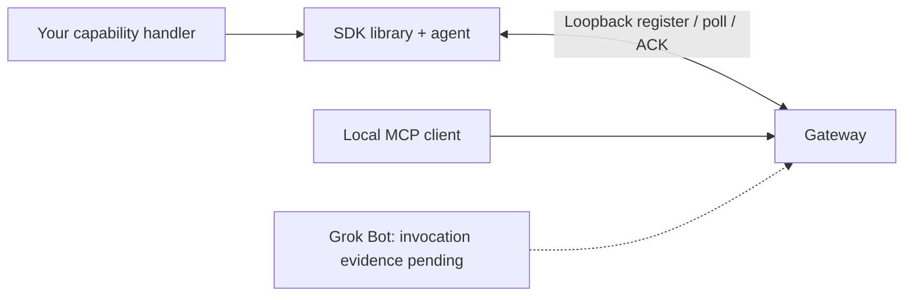

# Grok Gadgets Linux SDK

Build a software or Linux device application with this Python library and local agent. Install the Grok Gadgets gateway separately to route commands.

Documentation uses an [ASD-STE100-inspired writing guide](https://github.com/adidshaft/grok-gadgets/blob/main/docs/contributing/writing-guide.md). Formal compliance is not claimed.

**Experimental alpha.** Software simulation and installed custom factories have passed tests. Recorded tests also cover a Linux aarch64 container. Physical peripherals, real systemd operation, actual Grok invocation and mobile behavior remain unverified.



The SDK implements a device application; the gateway routes assistant requests. They are
separate packages. The software example reports state without operating a physical device.

## Choose a first step

- **Try a custom application:** run the fresh installed-wheel example below.
- **Write a handler:** follow [development](docs/development.md); no hardware is required.
- **Run an agent:** read [operation and recovery](docs/operation.md).
- **Contribute:** use [CONTRIBUTING](CONTRIBUTING.md), [support](SUPPORT.md), and
  [GitHub Issues](https://github.com/adidshaft/grok-gadgets-linux-sdk/issues).

## Try a custom software device

You need uv, Python 3.11, tar and three package files. The verified host is Apple Silicon with native Python 3.11.15. Installation can need internet access.

This check starts an authenticated loopback listener and closes it afterward. It needs no Grok account, API key, hardware or persistent service.

Package releases are not published yet. Run `uv sync --frozen` and `uv build` in this repository. Build the gateway wheel separately. A hub checkout is not necessary.

Put these files in an empty working folder:

- `grok_gadgets_linux_sdk-0.1.0a1-py3-none-any.whl`
- `grok_gadgets_linux_sdk-0.1.0a1.tar.gz`
- `grok_gadgets_gateway-0.1.0a1-py3-none-any.whl`

From that folder:

```sh
uv venv --python 3.11 --seed .venv
.venv/bin/python -m pip install ./grok_gadgets_linux_sdk-0.1.0a1-py3-none-any.whl ./grok_gadgets_gateway-0.1.0a1-py3-none-any.whl
tar -xzf grok_gadgets_linux_sdk-0.1.0a1.tar.gz
.venv/bin/python -I grok_gadgets_linux_sdk-0.1.0a1/scripts/check_onboarding.py grok_gadgets_linux_sdk-0.1.0a1/docs/development.md
```

The source archive contains the verifier and documented Python example. The verifier creates a trusted `my_gadget.py` in a temporary folder. It starts the installed agent with `--factory-file ./my_gadget.py:create`.

The verifier authenticates `display-1`, requests `display.set`, and checks the acknowledgement and state:

```json
{"custom_capability": "display.set", "ack": "executed", "state": {"text": "installed custom works"}, "simulated": true, "physical_verified": false}
```

This is part of the report. Imports use installed packages. The check uses no editable installation or implicit source path.

The result verifies SDK-to-gateway software behavior over TCP. It does not verify a Grok invocation or an MCP client session.

## What the library does

1. Define a `Device`.
2. Declare capabilities and their argument schemas.
3. Write asynchronous handlers that return reported state.

The agent registers the device, polls for commands, acknowledges results and sends queued events. The default lamp and optional `--simulate-button` are simulations.

Factory files execute trusted local code. Do not execute untrusted content from a conversation.

The SDK checks protocol hashes at import. The canonical contract is [gateway protocol 0.1.0](https://github.com/adidshaft/grok-gadgets-gateway/tree/main/protocol/0.1.0). See [source.json](src/grok_gadgets_linux/protocol/source.json) for the source commit and hashes. Do not edit copied schemas independently.

## Compatibility and evidence

Package `0.1.0a1` and protocol `0.1.0` identify different contracts.
Declared Python `>=3.11` support does not establish every platform/version.

| Path | Evidence | Remaining limit |
| --- | --- | --- |
| macOS arm64, CPython 3.11.15 | Source/CLI checks and fresh installed documented/custom-dataclass onboarding | Physical peripherals and independent human reproduction |
| Linux aarch64 container, CPython 3.11.17 | Recorded offline installed-wheel software acceptance | Other distributions/architectures; real service/peripheral behavior |
| Single SDK checkout | Unit/CLI suite; five gateway-source integration cases explicitly skip | Run exact pinned cross-repository checks before promotion |
| Windows / Intel Mac | Not verified | Clean installation and runtime checks |
| Grok / mobile | Native invocation/client evidence pending | Reviewed supported route to the gateway |
| Systemd / real peripherals | Template and APIs supplied; operation unverified | Authorized host/peripheral observations |

[Launch verification](docs/verification/launch-docs.md) records the first-run proof.
[Historical Linux evidence](docs/verification.md) retains the exact container/image and
software-only boundaries. A Mac test never establishes Linux peripheral behavior.

## Fit, limitations, and help

The [gateway](https://github.com/adidshaft/grok-gadgets-gateway) owns assistant tools and
canonical contracts; the [hub](https://github.com/adidshaft/grok-gadgets) owns shared
architecture, roadmap, and policies. The SDK's own unit checks require no sibling checkout.

The agent accepts only loopback TCP. A cloud Bot cannot execute your local file path. This SDK does not provide an authenticated remote route.

Command and event caches have limits and exist only in memory. Never use a new ID to retry an uncertain physical action. An oversized acknowledgement can also bypass result caching; see [issue 8](https://github.com/adidshaft/grok-gadgets-linux-sdk/issues/8). Read [operation](docs/operation.md) and [security](SECURITY.md) before you connect hardware.

| Symptom | Next step |
| --- | --- |
| Token missing / rejected | Supply the authorized per-device token privately; never include it in issue logs. |
| Custom file cannot load | Use `--factory-file ./my_gadget.py:create`; install its dependencies in the same environment. |
| Packaged factory unavailable | Install that package, then use `--factory package.module:create`. |
| Five tests skip | Expected in one checkout; see the optional pinned gateway integration command in [CONTRIBUTING](CONTRIBUTING.md). |
| Dependency installation fails | Use the selected Python 3.11 environment above; another system interpreter/architecture is not the verified baseline. |
| Reconnect budget exhausted | Diagnose the gateway/session, then restart deliberately. |

Use [SUPPORT](SUPPORT.md), [SECURITY](SECURITY.md), and
[CODE_OF_CONDUCT](CODE_OF_CONDUCT.md). Do not post tokens, household data, private events,
or account captures.

Original code and copied protocol artifacts are [Apache-2.0](LICENSE).
Retain [NOTICE](NOTICE) and dependency licenses. This independent project is exclusively
for Grok and is not affiliated with xAI.

## History note

Pre-publication commit dates were reconstructed across 29 September–5 October 2026 at the owner’s request. Verification records retain their actual execution dates. See the [history and privacy record](https://github.com/adidshaft/grok-gadgets/blob/main/docs/verification/publication-sanitization.md).
