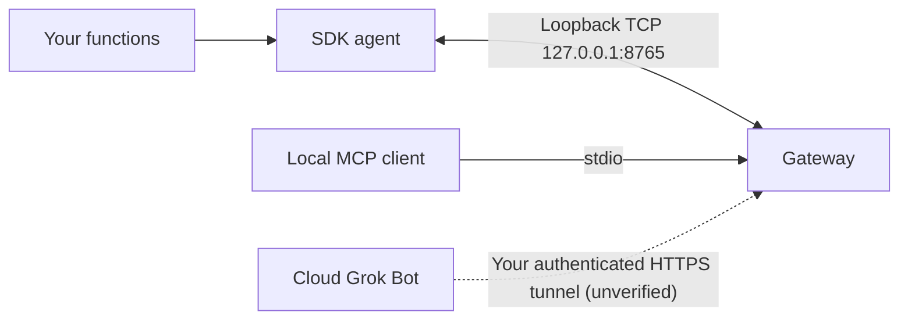

# Grok Gadgets Linux SDK

Turn a Linux computer or Raspberry Pi into a gadget that Grok can use. You write small
Python functions, such as "turn the lamp on". This SDK's agent connects them to the
[Grok Gadgets gateway](https://github.com/adidshaft/grok-gadgets-gateway) on the same
computer, and the gateway offers them to an AI assistant as MCP tools. It is an
experimental alpha.

## What works with Grok Bot today

- **Local MCP client on the same computer:** works. A client that starts the gateway
  can list your gadget and call its functions. Tested in software only.
- **Grok Bot (cloud):** reaches a Linux gadget only if you run the gateway's
  `grok-gadgets-gateway serve` mode and expose it through your own authenticated HTTPS
  tunnel. This route is implemented in the gateway but **not verified with Grok Bot**.
  Never expose the agent's device port (8765).
- **Not verified:** physical peripherals, real systemd operation, Raspberry Pi hardware,
  and any actual Grok invocation.

## Quickstart

**1. Install.** Packages are not published yet. Build the wheels (`uv build` in this
repository and in the gateway repository), then install both into one environment:

```sh
python3 -m venv .venv
.venv/bin/pip install grok_gadgets_linux_sdk-0.1.0a1-py3-none-any.whl grok_gadgets_gateway-0.1.0a1-py3-none-any.whl
```

**2. Get a token and start the gateway.** Run `.venv/bin/grok-gadgets-gateway enroll my-pi`.
It prints `GROK_GADGETS_DEVICE_TOKEN=...`. Set that variable privately in the agent's
terminal. Start the gateway in another terminal with `.venv/bin/grok-gadgets-gateway serve`.
These two commands belong to the gateway; see its README for options.

**3. Run your gadget.** Save this as `my_gadget.py`:

```python
from grok_gadgets_linux import Device


def create():
    device = Device("my-pi", "My lamp", simulated=True, state={"on": False})

    def set_lamp(arguments):  # Replace with your GPIO code; it runs in a thread.
        return {"on": arguments["on"]}

    schema = {"type": "object", "properties": {"on": {"type": "boolean"}}, "required": ["on"]}
    device.capability("lamp.set", set_lamp, schema=schema)
    return device
```

Then start the agent:

```sh
.venv/bin/grok-linux-agent --factory-file ./my_gadget.py:create
```

The gateway now lists `my-pi` with a `lamp.set` command. Set `simulated=False` only
when your handler really controls hardware.

## Details

- [Develop a gadget](docs/development.md): handlers, plain vs. async functions, GPIO
  example, events, state limits, shutdown hooks and retries.
- [Run and recover](docs/operation.md): MCP client setup, systemd user service,
  reconnect limits and exit codes.
- [Security](SECURITY.md): trust model and known limits.
- [Contributing](CONTRIBUTING.md), [support](SUPPORT.md) and
  [GitHub Issues](https://github.com/adidshaft/grok-gadgets-linux-sdk/issues).

Documentation uses an [ASD-STE100-inspired writing guide](https://github.com/adidshaft/grok-gadgets/blob/main/docs/contributing/writing-guide.md). Formal compliance is not claimed.

### How it fits together



The SDK implements the device; the gateway routes assistant requests. They are separate
packages. The agent connects only to loopback (`127.0.0.1` or `::1`), so run it on the
gateway's computer. The builder runs the gateway; Grok/xAI hosts Grok Bot. A tunnel adds
reachability, not authentication. See the
[hosting FAQ](https://github.com/adidshaft/grok-gadgets/blob/main/docs/getting-started/hosting.md)
and `HARD-GROK-REMOTE-001`.

Factory files execute trusted local code. Do not execute content from a conversation.
The SDK checks hashes of its copied [gateway protocol 0.1.0](https://github.com/adidshaft/grok-gadgets-gateway/tree/main/protocol/0.1.0)
files at import; see [source.json](src/grok_gadgets_linux/protocol/source.json).

### Supported platforms

Python 3.11 or later. CI is configured for 3.11, 3.12, 3.13 and 3.14 on Ubuntu; hosted
runs of that matrix are pending.

| Raspberry Pi | OS architecture | Dependency wheels |
| --- | --- | --- |
| Pi 5, Pi 4, Pi 3, Zero 2 W | aarch64 (64-bit OS) or armv7l (32-bit OS) | Available on PyPI |
| Pi Zero, Zero W, Pi 1 | armv6l | `rpds-py` (through `jsonschema`) has no PyPI wheel. Use a piwheels build if one exists (not checked), or install a Rust toolchain so pip can build it |

No Raspberry Pi was used to test this SDK.

### Evidence

| Path | Evidence | Remaining limit |
| --- | --- | --- |
| macOS arm64, CPython 3.11.15, 3.12.13, 3.13.15, 3.14.7 | Unit, CLI, shipped-unit `ExecStart` (no systemd) and gateway-source integration tests, 5 October 2026 | Not Linux |
| Linux aarch64 container, CPython 3.11.17 | Linux container software acceptance (partial): installed-wheel tests with gateway integration, 5 October 2026 | A non-container Linux host; other distributions; real service and peripherals |
| Windows / Intel Mac | Not verified | Installation and runtime checks |
| Grok / mobile | Not verified | Supported route to the gateway |
| systemd / peripherals | Template and APIs supplied; not operated | Authorized host and peripheral observations |

[Launch verification](docs/verification/launch-docs.md) and the
[historical Linux record](docs/verification.md) keep the exact boundaries. A Mac test
never establishes Linux peripheral behavior.

### Troubleshooting

The agent prints `Agent stopped (<code>). <hint>` and exits with a distinct code.

| Exit | Meaning | Next step |
| --- | --- | --- |
| 2 | Configuration (`token_missing`, `factory_error`, ...) | Set `GROK_GADGETS_DEVICE_TOKEN`; use `--factory-file ./my_gadget.py:create` and install its dependencies |
| 3 | `unauthorized` or `revoked` | Enroll the device again; never paste the token in issue logs |
| 4 | Protocol contract, for example `frame_too_large` | Shorten schemas, descriptions or state (2048-byte frames) |
| 5 | `reconnect_exhausted` | Start the gateway, or use `--retry-forever` |

`GROK_DEVICE_TOKEN` still works but is deprecated. Without `GROK_GATEWAY_SOURCE`, seven
gateway integration tests skip; see [CONTRIBUTING](CONTRIBUTING.md).

Command and event caches are limited and exist only in memory. Never use a new command
ID to retry an uncertain physical action.

### Help and license

Use [SUPPORT](SUPPORT.md), [SECURITY](SECURITY.md), and
[CODE_OF_CONDUCT](CODE_OF_CONDUCT.md). Do not post tokens, household data, private events,
or account captures.

Original code and copied protocol artifacts are [Apache-2.0](LICENSE).
Retain [NOTICE](NOTICE) and dependency licenses. This independent project is exclusively
for Grok and is not affiliated with xAI.

### History note

Pre-publication commit dates were reconstructed across 29 September–5 October 2026 at the owner’s request. Verification records retain their actual execution dates. See the [history and privacy record](https://github.com/adidshaft/grok-gadgets/blob/main/docs/verification/publication-sanitization.md).
