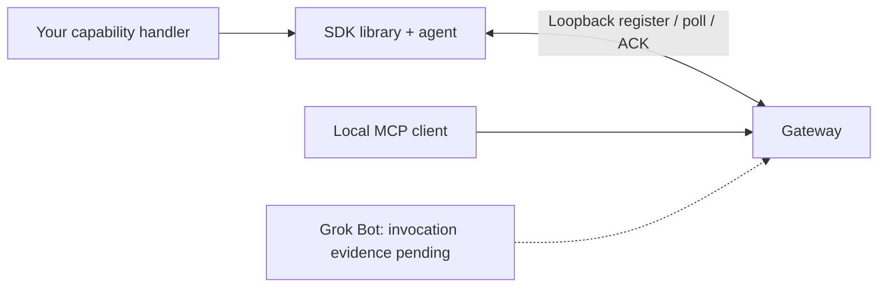

# Grok Gadgets Linux SDK

A Python capability library and local device agent for applications targeting Grok
through the separately installed Grok Gadgets gateway.

**Experimental alpha.** Software simulation and installed custom factories are tested.
Recorded Linux aarch64 container acceptance exists; physical peripherals, real systemd
operation, native Grok invocation receipts, and mobile behavior remain unverified.



The SDK implements a device application; the gateway routes assistant requests. They are
separate packages. The software example reports state without operating a physical device.

## Choose a first step

- **Try a custom application:** run the fresh installed-wheel example below.
- **Write a handler:** follow [development](docs/development.md); no hardware is required.
- **Run an agent:** read [operation and recovery](docs/operation.md).
- **Contribute:** use [CONTRIBUTING](CONTRIBUTING.md), [support](SUPPORT.md), and
  [local issues](planning/issues.json).

## Try a custom software device

Requirements: uv, Python 3.11, tar, and the three prepared package files below.
Native Apple Silicon Python 3.11.15 is the freshly tested baseline. Installation may
need network access. The check uses a temporary authenticated loopback listener,
closes it afterward, and needs no Grok account, API key, hardware, or persistent service.

Public GitHub and release URLs are **planned destinations pending activation**.
For the local candidate, run `uv sync --frozen` and `uv build` in this repository
and build the gateway wheel separately. No hub checkout is required. Put these files
in an otherwise empty working folder:

- `grok_gadgets_linux_sdk-0.1.0a1-py3-none-any.whl`
- `grok_gadgets_linux_sdk-0.1.0a1.tar.gz`
- `grok_gadgets_gateway-0.1.0a1-py3-none-any.whl`

From that folder:

```sh
uv venv --python 3.11 --seed .venv
.venv/bin/python -m pip install ./grok_gadgets_linux_sdk-0.1.0a1-py3-none-any.whl ./grok_gadgets_gateway-0.1.0a1-py3-none-any.whl
tar -xzf grok_gadgets_linux_sdk-0.1.0a1.tar.gz
.venv/bin/python -I grok_gadgets_linux_sdk-0.1.0a1/scripts/check_onboarding.py grok_gadgets_linux_sdk-0.1.0a1/docs/development.md
```

The source archive supplies a readable verifier and the exact documented Python example.
The verifier creates a trusted `my_gadget.py` in a fresh temporary folder and starts
the installed agent with `--factory-file ./my_gadget.py:create`. It authenticates
`display-1`, requests `display.set`, and asserts the acknowledgement and state:

```json
{"custom_capability": "display.set", "ack": "executed", "state": {"text": "installed custom works"}, "simulated": true, "physical_verified": false}
```

That is a subset of the report. Imports come from installed packages, with no editable
install or implicit source path. This verifies SDK-to-gateway TCP software behavior,
not a Grok invocation or MCP-client session. Both packages are installed; no source
sibling is imported.

## What the library does

Define a `Device`, declare capabilities with inline argument schemas, and implement
async handlers returning reported state. The agent registers, polls commands,
acknowledges results, and sends queued events. The CLI's default lamp and optional
`--simulate-button` are explicit simulation. Arbitrary factory files execute trusted
local code, never untrusted content from a conversation.

Protocol copies are hash checked at import. The canonical version is
[protocol 0.1.0 in the gateway](https://github.com/adidshaft/grok-gadgets-gateway/tree/main/protocol/0.1.0);
the exact consumed commit and hashes are in [source.json](src/grok_gadgets_linux/protocol/source.json).
Do not independently rewrite those schemas.

## Compatibility and evidence

Package `0.1.0a1` and protocol `0.1.0` identify different contracts.
Declared Python `>=3.11` support does not establish every platform/version.

| Path | Evidence | Remaining limit |
| --- | --- | --- |
| macOS arm64, CPython 3.11.15 | Source/CLI checks and fresh installed documented/custom-dataclass onboarding | Physical peripherals and independent human reproduction |
| Linux aarch64 container, CPython 3.11.17 | Recorded offline installed-wheel software acceptance | Other distributions/architectures; real service/peripheral behavior |
| Single SDK checkout | Unit/CLI suite; five gateway-source integration cases explicitly skip | Run exact pinned cross-repository checks before promotion |
| Windows / Intel Mac | Not verified | Clean installation and runtime checks |
| Grok / mobile | Native invocation/client evidence pending | Reviewed supported route to the gateway |
| Systemd / real peripherals | Template and APIs supplied; operation unverified | Authorized host/peripheral observations |

[Launch verification](docs/verification/launch-docs.md) records the first-run proof.
[Historical Linux evidence](docs/verification.md) retains the exact container/image and
software-only boundaries. A Mac test never establishes Linux peripheral behavior.

## Fit, limitations, and help

The [gateway](https://github.com/adidshaft/grok-gadgets-gateway) owns assistant tools and
canonical contracts; the [hub](https://github.com/adidshaft/grok-gadgets) owns shared
architecture, roadmap, and policies. Cross-repository URLs become usable after approved
publication; the SDK's own unit checks require no sibling checkout.

The agent accepts only loopback TCP. A cloud Bot cannot execute your local filesystem
path; a reviewed authenticated remote route is not provided here. Command/event retention
is bounded and memory-only. Lost acknowledgements or restarts must not trigger a blind
physical retry under a new ID. See [operation](docs/operation.md) and [security](SECURITY.md).

| Symptom | Next step |
| --- | --- |
| Token missing / rejected | Supply the authorized per-device token privately; never include it in issue logs. |
| Custom file cannot load | Use `--factory-file ./my_gadget.py:create`; install its dependencies in the same environment. |
| Packaged factory unavailable | Install that package, then use `--factory package.module:create`. |
| Five tests skip | Expected in one checkout; see the optional pinned gateway integration command in [CONTRIBUTING](CONTRIBUTING.md). |
| Dependency installation fails | Use the selected Python 3.11 environment above; another system interpreter/architecture is not the verified baseline. |
| Reconnect budget exhausted | Diagnose the gateway/session, then restart deliberately. |

Use [SUPPORT](SUPPORT.md), [SECURITY](SECURITY.md), and
[CODE_OF_CONDUCT](CODE_OF_CONDUCT.md). Do not post tokens, household data, private events,
or account captures.

Original code and copied protocol artifacts are [Apache-2.0](LICENSE).
Retain [NOTICE](NOTICE) and dependency licenses. This independent project is exclusively
for Grok and is not affiliated with xAI.

## History note

Pre-publication commit dates were reconstructed across 29 September–5 October 2026 at the owner’s request. Verification records retain their actual execution dates. See the [history and privacy record](https://github.com/adidshaft/grok-gadgets/blob/main/docs/verification/publication-sanitization.md).
