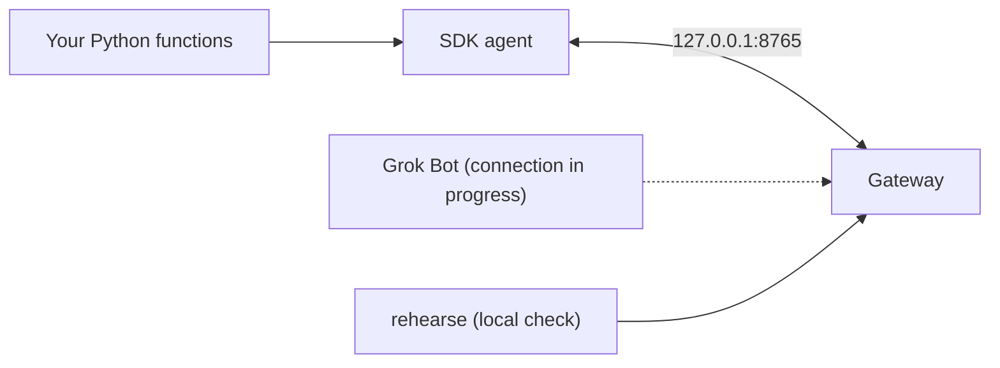

# Grok Gadgets Linux SDK

Turn Python functions into gadgets your Grok Bot can call through the
[Grok Gadgets gateway](https://github.com/adidshaft/grok-gadgets-gateway). Start with a
software lamp; add your hardware code later. Experimental alpha: Grok Bot and hardware are
not verified yet ([project status](https://grok-gadgets.pages.dev/doc-docs-public-support-matrix)).
Independent project, not affiliated with SpaceXAI or xAI.

## Quickstart

Needs Git and [uv](https://docs.astral.sh/uv/getting-started/installation/). Packages are
not on PyPI yet.

```sh
git clone https://github.com/adidshaft/grok-gadgets-linux-sdk.git
cd grok-gadgets-linux-sdk
uv sync --extra gateway
```

Save this as `my_gadget.py`:

```python
from grok_gadgets_linux import Gadget

lamp = Gadget("desk-lamp", "Desk lamp", state={"on": False})


@lamp.command("Turn the desk lamp on or off")
def set_light(on: bool) -> dict:
    # Your hardware code goes here, for example gpio.write(17, on).
    return {"on": on}
```

Run it:

```sh
uv run grok-linux-agent dev ./my_gadget.py
```

`dev` starts a local gateway, connects your gadget with no token to copy, and prints the
connector settings Grok Bot will use. The next gateway release adds a rehearsal of the Grok
Bot call: `uv run grok-gadgets-gateway rehearse --device desk-lamp --command set.light --args '{"on": true}'`.

## How it works



Your file declares a `Gadget` and its commands. The agent connects it to the
[gateway](https://github.com/adidshaft/grok-gadgets-gateway) on the same computer, and the
gateway offers its commands to Grok Bot, with your one-line descriptions. `dev` runs both
in one process. Each command's schema comes from its type hints, so the SDK refuses bad arguments before your code runs.

## Add your hardware

Put your GPIO, I2C or serial code inside the command function. Plain functions run in a worker
thread, so blocking calls are fine; `async def` works too. Return what the device now
reports. Set `simulated=False` only when your code really controls hardware.

```python
from typing import Annotated

from grok_gadgets_linux import Range


@lamp.command("Set the brightness from 0 to 100", name="level.set")
def level(level: Annotated[int, Range(0, 100)]) -> dict:
    # pwm.duty(level)  <- your hardware call goes here
    return {"level": level}
```

Events, shutdown hooks, the original `Device` API and limits are in the
[developer guide](docs/development.md).

## Run it as a service

Next to a long-running `grok-gadgets-gateway serve`, give the gadget its own token:

```sh
grok-gadgets-gateway enroll desk-lamp --token-file desk-lamp.token
grok-linux-agent --factory-file ./my_gadget.py --token-file desk-lamp.token
```

The agent re-reads the token file on every connection, so `enroll --rotate` needs no
restart. A systemd user unit template, reconnect limits and exit codes are in the
[operation guide](docs/operation.md) (systemd is not yet verified).

## Platforms

Python 3.11–3.14. CI runs on Ubuntu every night, including the README quick start and the
gateway integration tests against gateway `main`. Raspberry Pi 3, 4, 5 and Zero 2 W have PyPI wheels for every dependency. The armv6l models (Pi Zero, Zero W, Pi 1) need a Rust
toolchain for `rpds-py`. Nobody has tested a Raspberry Pi yet; see the
[project status](https://grok-gadgets.pages.dev/doc-docs-public-support-matrix).

## Troubleshooting

The agent prints `Agent stopped (<code>). <hint>` and exits with a distinct code.

| Exit | Meaning | Next step |
| --- | --- | --- |
| 2 | Configuration (`token_missing`, `factory_error`, ...) | Use `grok-linux-agent dev ./my_gadget.py`, or set `--token-file`; install the gadget's dependencies |
| 3 | `unauthorized` or `revoked` | Check the device ID and token; see [token recovery](docs/operation.md#recover-a-device-token) |
| 4 | Protocol contract, for example `frame_too_large` | Shorten schemas, descriptions or state (16 KiB hello, 2048-byte other frames) |
| 5 | `reconnect_exhausted` | Start the gateway, or use `--retry-forever` |

Never retry an uncertain physical action with a new command ID: read the state first.
Gadget files run trusted local code; never run code from a conversation.

## Community

Show your gadget, ask questions and share ideas on
[r/GrokGadgets](https://www.reddit.com/r/GrokGadgets/). Report bugs in
[GitHub Issues](https://github.com/adidshaft/grok-gadgets-linux-sdk/issues). New here? Pick a
[good first issue](https://github.com/adidshaft/grok-gadgets-linux-sdk/issues?q=is%3Aissue+is%3Aopen+label%3A%22good+first+issue%22)
and read [CONTRIBUTING](CONTRIBUTING.md). Help: [SUPPORT](SUPPORT.md). Security:
[SECURITY](SECURITY.md). Keep tokens and household details out of public posts.
Contribute on the `dev` branch; `main` holds tagged stable releases ([branches](CONTRIBUTING.md#branches)).

## License and affiliation

Apache-2.0; see [LICENSE](LICENSE) and [NOTICE](NOTICE). Grok Gadgets is an independent
open-source project. It is **not affiliated with, endorsed by or sponsored by SpaceXAI or
xAI**, which make Grok and Grok Bot. We reconstructed the pre-publication commit dates; see the
[history record](https://github.com/adidshaft/grok-gadgets/blob/main/docs/verification/publication-sanitization.md).
Detailed verification records: [launch verification](docs/verification/launch-docs.md) and
[historical record](docs/verification.md).
